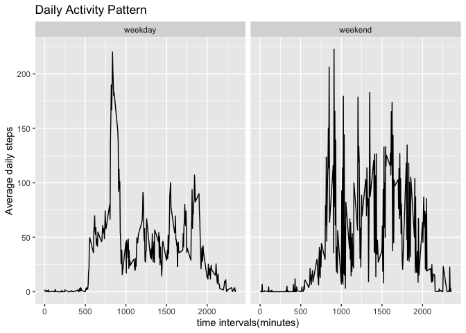

## Loading and preprocessing the data

```r
library(ggplot2)
library(tidyverse)

data<- read.csv("activity.csv")

data$date<- as.Date(data$date)
```

## What is mean total number of steps taken per day?

```r
#add counts of steps to each day
data_count<- data %>%  group_by(date) %>% summarise(total_steps = sum(steps, na.rm = TRUE))

#plot histogram of total number of steps per day
ggplot(data_count, aes(x= date, y= total_steps))+
  geom_bar(stat = "identity")+
  scale_x_date()+
  labs(title = "Total steps per day")
```

<!-- -->


```r
# calculate mean and median of steps taken per day 
data_mean<- data %>%  group_by(date) %>%  summarise(mean = mean(steps, na.rm =  TRUE))

data_median<-data %>% group_by(date) %>%  summarise(median = median(steps, na.rm = TRUE))

#report the mean and median values
data_report<- left_join(data_mean, data_median) %>% print()
```

```
## # A tibble: 61 x 3
##    date          mean median
##    <date>       <dbl>  <dbl>
##  1 2012-10-01 NaN         NA
##  2 2012-10-02   0.438      0
##  3 2012-10-03  39.4        0
##  4 2012-10-04  42.1        0
##  5 2012-10-05  46.2        0
##  6 2012-10-06  53.5        0
##  7 2012-10-07  38.2        0
##  8 2012-10-08 NaN         NA
##  9 2012-10-09  44.5        0
## 10 2012-10-10  34.4        0
## # … with 51 more rows
```

## What is the average daily activity pattern?

```r
#organise data into average steps against time interval
data_interval<- data %>%  group_by(interval) %>% summarise(average_steps = mean(steps, na.rm= TRUE)) 

#Make a time series plot (i.e. type = "l") of the 5-minute interval (x-axis) and the average number of steps taken, averaged across all days (y-axis)
ggplot(data_interval, aes(interval, average_steps))+
  geom_line()+
  labs(x = "time intervals(minutes)", y = "Average daily steps", title = "Daily Activity Pattern")
```

<!-- -->


```r
#print out question and answer for this segment
cat("Which 5-minute interval, on average across all the days in the dataset, contains the maximum number of steps?")
```

```
## Which 5-minute interval, on average across all the days in the dataset, contains the maximum number of steps?
```

```r
cat("
Time interval 1705 has the highest average steps across all days.")
```

```
## 
## Time interval 1705 has the highest average steps across all days.
```


## Imputing missing values

```r
#Calculate and report the total number of missing values in the dataset
cat(paste0("The total number of missing values in the dataset is ", nrow(data[is.na(data), ])))
```

```
## The total number of missing values in the dataset is 2304
```


```r
#filling in all of the missing values in the dataset with mean of values for the time interval
data_na<-left_join(data[is.na(data), ], data_interval) %>% select(-steps) 

colnames(data_na)<- c("date", "interval", "steps")

#Create a new dataset that is equal to the original dataset but with the missing data filled in.
data_new<-rbind(data_na, na.omit(data))
```


```r
#calculate total steps for each day with new dataset
data_new_sum<- data_new %>%  group_by(date) %>% summarise(total_steps = sum(steps))

#Make a histogram of the total number of steps taken each day. Calculate and report the mean and median total number of steps taken per day.

ggplot(data_new_sum, aes(x= date, y = total_steps))+
  geom_bar(stat = "identity")+
  labs(x= "date", y = "Number of steps", title = "Total number of steps taken per day")
```

<!-- -->

```r
#Calculate the mean total number of steps taken per day
data_new_mean<- data_new %>%  group_by(date) %>%  summarise(new_mean = mean(steps)) 

#Calculate the median total number of steps taken per day
data_new_median<- data_new %>%  group_by(date) %>%  summarise(new_median = median(steps)) 

#Report the mean and median of total number of steps taken per day
data_new_report<- left_join(data_new_mean, data_new_median) %>%  print()
```

```
## # A tibble: 61 x 3
##    date       new_mean new_median
##    <date>        <dbl>      <dbl>
##  1 2012-10-01   37.4         34.1
##  2 2012-10-02    0.438        0  
##  3 2012-10-03   39.4          0  
##  4 2012-10-04   42.1          0  
##  5 2012-10-05   46.2          0  
##  6 2012-10-06   53.5          0  
##  7 2012-10-07   38.2          0  
##  8 2012-10-08   37.4         34.1
##  9 2012-10-09   44.5          0  
## 10 2012-10-10   34.4          0  
## # … with 51 more rows
```


```r
#Do these values differ from the estimates from the first part of the assignment? 
data_mean_median<-left_join(data_report, data_new_report) %>% print()
```

```
## # A tibble: 61 x 5
##    date          mean median new_mean new_median
##    <date>       <dbl>  <dbl>    <dbl>      <dbl>
##  1 2012-10-01 NaN         NA   37.4         34.1
##  2 2012-10-02   0.438      0    0.438        0  
##  3 2012-10-03  39.4        0   39.4          0  
##  4 2012-10-04  42.1        0   42.1          0  
##  5 2012-10-05  46.2        0   46.2          0  
##  6 2012-10-06  53.5        0   53.5          0  
##  7 2012-10-07  38.2        0   38.2          0  
##  8 2012-10-08 NaN         NA   37.4         34.1
##  9 2012-10-09  44.5        0   44.5          0  
## 10 2012-10-10  34.4        0   34.4          0  
## # … with 51 more rows
```

```r
#tidy up the dataset
data_mean_median<- data_mean_median %>%  gather(key = "stats", value = "value", -date)

#What is the impact of imputing missing data on the estimates of the total daily number of steps?

ggplot(data_mean_median, aes(x= date, y = value))+
  geom_line(aes(color = stats, linetype = stats))+
  scale_color_manual(values = c("purple", "darkred", "darkgreen", "orange"))
```

<!-- -->

```r
cat(paste0("Imputing the data decreased the median."))
```

```
## Imputing the data decreased the median.
```
## Are there differences in activity patterns between weekdays and weekends?

```r
#Create a new factor variable in the dataset with two levels – “weekday” and “weekend”
data_new <- data_new %>% mutate(weekday = weekdays(date)) 

data_new$weekday<-factor(ifelse(data_new$weekday == c("Saturday", "Sunday"), "weekend", "weekday"))

print(head(data_new))
```

```
##         date interval     steps weekday
## 1 2012-10-01        0 1.7169811 weekday
## 2 2012-10-01        5 0.3396226 weekday
## 3 2012-10-01       10 0.1320755 weekday
## 4 2012-10-01       15 0.1509434 weekday
## 5 2012-10-01       20 0.0754717 weekday
## 6 2012-10-01       25 2.0943396 weekday
```


```r
#calculate sum of steps per interval for both weekends and weekdays
 data_new_sum<-aggregate(steps~weekday+interval, data = data_new, sum)

#Make a panel plot containing a time series plot (i.e. type = "l") of the 5-minute interval (x-axis) and the average number of steps taken, averaged across all weekday days or weekend days (y-axis).
ggplot(data_new_sum, aes(interval, steps))+
  geom_line()+
  facet_grid(~weekday)+
  labs(x = "time intervals(minutes)", y = "Average daily steps", title = "Daily Activity Pattern")
```

<!-- -->
